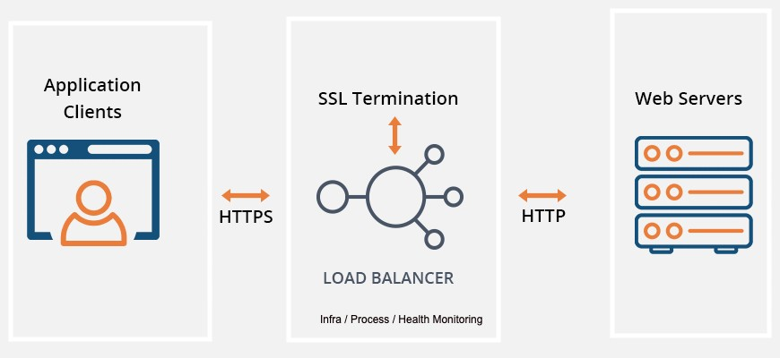

##### Use Case: Metrics measurement for the server doing SSL-Offloading and Proxying 250000 request per second.

# Usual Architecture: 



# Which Metrics To Monitor and How to do that? 

============================
##  Server Stats
Type : White Box Monitoring \
Type of Data : Time Series \
How to get : Running Node Exporter on server 

| Type | Description | Why? |
| --- | --- | --- | 
| CPU Stats |  Time CPU spent | SSL Offloading is cpu sensitive process so its important to monitor CPU metrics (user,system,io,nice) | 
| Disk Stats |  Disk I/O metrics from /proc/diskstats | To measure DISK IO of the server while performing Encrytion / Decryption | 
| FileSystem |  Exposes filesystem statistics, such as disk space used.	| To track the disk space of the server from different partitions |
| loadavg | System's workload for last 15 minutes./proc/loadavg | Load averages can be useful for a quick and dirty idea if a machine has gotten busier (for some definition of busier) recently | 
| netstat | Network statistics from /proc/net/netstat | Get key network metrics from SSL-offloading server | 
| meminfo | Exposes the memory stat | Memory related metrics of server to identify memory issues | 
| filefd | Exposes metrics of file descriptor. Exposes file descriptor statistics from /proc/sys/fs/file-nr. | To check number of FD of the server | 

Examples: 
##### CPU Stats 
```bash
# HELP node_cpu_seconds_total Seconds the cpus spent in each mode.
# TYPE node_cpu_seconds_total counter
node_cpu_seconds_total{cpu="0",mode="idle"} 48649.88
node_cpu_seconds_total{cpu="0",mode="iowait"} 169.99
node_cpu_seconds_total{cpu="0",mode="irq"} 0
node_cpu_seconds_total{cpu="0",mode="nice"} 57.5
node_cpu_seconds_total{cpu="0",mode="softirq"} 8.05
node_cpu_seconds_total{cpu="0",mode="steal"} 0
node_cpu_seconds_total{cpu="0",mode="system"} 1058.32
node_cpu_seconds_total{cpu="0",mode="user"} 4234.94
node_cpu_seconds_total{cpu="1",mode="idle"} 9413.55
node_cpu_seconds_total{cpu="1",mode="iowait"} 57.41
node_cpu_seconds_total{cpu="1",mode="irq"} 0
node_cpu_seconds_total{cpu="1",mode="nice"} 46.55
node_cpu_seconds_total{cpu="1",mode="softirq"} 7.58
node_cpu_seconds_total{cpu="1",mode="steal"} 0
node_cpu_seconds_total{cpu="1",mode="system"} 1034.82
node_cpu_seconds_total{cpu="1",mode="user"} 4285.06
```

##### Disk Stats
```bash
# HELP node_disk_io_now The number of I/Os currently in progress.
# TYPE node_disk_io_now gauge
node_disk_io_now{device="sda"} 0
```

# Info for other metrics in Disk Stats: 
```bash
node_disk_io_now
The number of I/Os in progress.

node_disk_io_time_seconds_total
Incremented when I/O is in progress.

node_disk_read_bytes_total
Bytes read by I/Os.

node_disk_read_time_seconds_total
The time taken by read I/Os.

node_disk_reads_completed_total
The number of complete I/Os.

node_disk_written_bytes_total
Bytes written by I/Os.

node_disk_write_time_seconds_total
The time taken by write I/Os.

node_disk_writes_completed_total
The number of complete write I/Os.
```

#####  FileSystem
```bash
# HELP node_filesystem_avail_bytes Filesystem space available to non-root users in bytes.
# TYPE node_filesystem_avail_bytes gauge
node_filesystem_avail_bytes{device="/dev/mapper/vg1-lv_root",fstype="ext4",mountpoint="/"} 2.0224393216e+10

# HELP node_filesystem_device_error Whether an error occurred while getting statistics for the given device.
# TYPE node_filesystem_device_error gauge
node_filesystem_device_error{device="/dev/mapper/vg1-lv_root",fstype="ext4",mountpoint="/"} 0


# HELP node_filesystem_files Filesystem total file nodes.
# TYPE node_filesystem_files gauge
node_filesystem_files{device="/dev/mapper/vg1-lv_root",fstype="ext4",mountpoint="/"} 1.671168e+06


# HELP node_filesystem_files_free Filesystem total free file nodes.
# TYPE node_filesystem_files_free gauge
node_filesystem_files_free{device="/dev/mapper/vg1-lv_root",fstype="ext4",mountpoint="/"} 1.553931e+06


# HELP node_filesystem_free_bytes Filesystem free space in bytes.
# TYPE node_filesystem_free_bytes gauge
node_filesystem_free_bytes{device="/dev/mapper/vg1-lv_root",fstype="ext4",mountpoint="/"} 2.1593411584e+10


# HELP node_filesystem_readonly Filesystem read-only status.
# TYPE node_filesystem_readonly gauge
node_filesystem_readonly{device="/dev/mapper/vg1-lv_root",fstype="ext4",mountpoint="/"} 0


# HELP node_filesystem_size_bytes Filesystem size in bytes.
# TYPE node_filesystem_size_bytes gauge
node_filesystem_size_bytes{device="/dev/mapper/vg1-lv_root",fstype="ext4",mountpoint="/"} 2.6950791168e+10

```

##### loadavg
```bash
# HELP node_load1 1m load average.
# TYPE node_load1 gauge
node_load1 0
# HELP node_load15 15m load average.
# TYPE node_load15 gauge
node_load15 0
# HELP node_load5 5m load average.
# TYPE node_load5 gauge
node_load5 0
```

##### Netstat
```bash
# HELP node_netstat_Icmp_InErrors Statistic IcmpInErrors.
# TYPE node_netstat_Icmp_InErrors untyped
node_netstat_Icmp_InErrors 808

# HELP node_netstat_Icmp_InMsgs Statistic IcmpInMsgs.
# TYPE node_netstat_Icmp_InMsgs untyped
node_netstat_Icmp_InMsgs 147294

# HELP node_netstat_Icmp_OutMsgs Statistic IcmpOutMsgs.
# TYPE node_netstat_Icmp_OutMsgs untyped
node_netstat_Icmp_OutMsgs 2.287623e+06

# HELP node_netstat_IpExt_InOctets Statistic IpExtInOctets.
# TYPE node_netstat_IpExt_InOctets untyped
node_netstat_IpExt_InOctets 8.9438844307199e+13

# HELP node_netstat_IpExt_OutOctets Statistic IpExtOutOctets.
# TYPE node_netstat_IpExt_OutOctets untyped
node_netstat_IpExt_OutOctets 7.2850849351548e+13

# HELP node_netstat_Ip_Forwarding Statistic IpForwarding.
# TYPE node_netstat_Ip_Forwarding untyped
node_netstat_Ip_Forwarding 2

# HELP node_netstat_TcpExt_ListenDrops Statistic TcpExtListenDrops.
# TYPE node_netstat_TcpExt_ListenDrops untyped
node_netstat_TcpExt_ListenDrops 221179

# HELP node_netstat_TcpExt_ListenOverflows Statistic TcpExtListenOverflows.
# TYPE node_netstat_TcpExt_ListenOverflows untyped
node_netstat_TcpExt_ListenOverflows 221179

# HELP node_netstat_TcpExt_SyncookiesFailed Statistic TcpExtSyncookiesFailed.
# TYPE node_netstat_TcpExt_SyncookiesFailed untyped
node_netstat_TcpExt_SyncookiesFailed 3.21081859e+08

# HELP node_netstat_TcpExt_SyncookiesRecv Statistic TcpExtSyncookiesRecv.
# TYPE node_netstat_TcpExt_SyncookiesRecv untyped
node_netstat_TcpExt_SyncookiesRecv 0

# HELP node_netstat_TcpExt_SyncookiesSent Statistic TcpExtSyncookiesSent.
# TYPE node_netstat_TcpExt_SyncookiesSent untyped
node_netstat_TcpExt_SyncookiesSent 0

# HELP node_netstat_Tcp_ActiveOpens Statistic TcpActiveOpens.
# TYPE node_netstat_Tcp_ActiveOpens untyped
node_netstat_Tcp_ActiveOpens 1.474712764e+09

# HELP node_netstat_Tcp_CurrEstab Statistic TcpCurrEstab.
# TYPE node_netstat_Tcp_CurrEstab untyped
node_netstat_Tcp_CurrEstab 105

# HELP node_netstat_Tcp_InErrs Statistic TcpInErrs.
# TYPE node_netstat_Tcp_InErrs untyped
node_netstat_Tcp_InErrs 0

# HELP node_netstat_Tcp_InSegs Statistic TcpInSegs.
# TYPE node_netstat_Tcp_InSegs untyped
node_netstat_Tcp_InSegs 8.154639172e+10

# HELP node_netstat_Tcp_OutSegs Statistic TcpOutSegs.
# TYPE node_netstat_Tcp_OutSegs untyped
node_netstat_Tcp_OutSegs 6.0452627456e+10

# HELP node_netstat_Tcp_PassiveOpens Statistic TcpPassiveOpens.
# TYPE node_netstat_Tcp_PassiveOpens untyped
node_netstat_Tcp_PassiveOpens 1.463120879e+09

# HELP node_netstat_Tcp_RetransSegs Statistic TcpRetransSegs.
# TYPE node_netstat_Tcp_RetransSegs untyped
node_netstat_Tcp_RetransSegs 6.1886211e+07

# HELP node_netstat_UdpLite_InErrors Statistic UdpLiteInErrors.
# TYPE node_netstat_UdpLite_InErrors untyped
node_netstat_UdpLite_InErrors 0

# HELP node_netstat_Udp_InDatagrams Statistic UdpInDatagrams.
# TYPE node_netstat_Udp_InDatagrams untyped
node_netstat_Udp_InDatagrams 8.90284079e+08

# HELP node_netstat_Udp_InErrors Statistic UdpInErrors.
# TYPE node_netstat_Udp_InErrors untyped
node_netstat_Udp_InErrors 25412

# HELP node_netstat_Udp_NoPorts Statistic UdpNoPorts.
# TYPE node_netstat_Udp_NoPorts untyped
node_netstat_Udp_NoPorts 2.156979e+06

# HELP node_netstat_Udp_OutDatagrams Statistic UdpOutDatagrams.
# TYPE node_netstat_Udp_OutDatagrams untyped
node_netstat_Udp_OutDatagrams 8.9404845e+08

```
##### Meminfo 
```bash

# HELP node_memory_Mapped_bytes Memory information field Mapped_bytes.
# TYPE node_memory_Mapped_bytes gauge
node_memory_Mapped_bytes 5.3149696e+07

# HELP node_memory_MemFree_bytes Memory information field MemFree_bytes.
# TYPE node_memory_MemFree_bytes gauge
node_memory_MemFree_bytes 4.070977536e+09

# HELP node_memory_MemTotal_bytes Memory information field MemTotal_bytes.
# TYPE node_memory_MemTotal_bytes gauge
node_memory_MemTotal_bytes 8.25524224e+09

```

##### filefd
```bash
# HELP node_filefd_allocated File descriptor statistics: allocated.
# TYPE node_filefd_allocated gauge
node_filefd_allocated 1312

# HELP node_filefd_maximum File descriptor statistics: maximum.
# TYPE node_filefd_maximum gauge
node_filefd_maximum 793830
```
============================


## Proxy Server Stats 

Type : White Box Monitoring \
Type of Data : Time Series  \
How to get : Running  Exporter on server for Proxy Server if available (Example: NginxVTS Exporter, HAProxy Exporter, F5 Exporter, Netscalar Exporter, Squid Exporter) 


| Type | Description | Why? |
| --- | --- | --- | 
| Inbound Traffic |  The number of bytes sent from external endpoints to configured backends through the SSL-Offloading Server (in bytes per sec). | To understand inbound traffic rate | 
| Outbound Traffic |  The number of bytes sent from configured backends to external endpoints through the SSL-Offloading Server (in bytes per sec). | To understand outbound traffic rate | 
| Open Connections |  The number of connections open at the given sample moment.  | To track TCP Open Connections |
| New Connections Per Second | The number of connections that were created (client successfully connected to backend) | To track the rate of newly added connection to open connection | 
| Closed Connections per second |  The number of connections that were closed.   | To track TCP Closed Connections |
| RTT |  RTT measured for each connection between client and SSL-Offloading Server | To track RTT | 


============================

## Network Stat Dump 
Type: Black Box Monitoring \
Type of Data : Textual \
How to get : With tcpdump 

Why: To measure network related troubles , security risks periodically. Compatible with tools like wireshark. 

============================

## Linux Kernel Dump
Type: Black Box Monitoring \
Type of Data: Textual \
How to get: Install and configure kdump 

Why : To measure the kernel crash (FROM unknown bugs which will require upgrade). Use kdump to visualize

============================

## Process Monitoring Metrics 
Type: White Box Monitoring \
Type of Data: Textual \
How to get: Install and configure Nagios for Exporters (Monitoring & Proxy server Exporters) Processes, SSL-Offloading Proxy Process.  

Why : To measure the processes are up and running

============================


## Key metrics for alerts on SSL Offloading Server : 

1. CPU load (SSL-Offloading is CPU sensitive process)
2. Increase in file descriptor (Slower responses and higher wait time will cause high FD's on server)
3. TCP Open Connections (TCP Connections open (Internet<->Proxy<->Backend) )
4. SSL Certificate Expiry on Proxy Server 
5. Memory Free (Free memory on the server)
6. SSL-Offloading Proxy Server Process Aliveness (With Nagios )

============================


# Challenges of SSL-Offloading Proxy Server Monitoring :

1. Compatibility metrics for clients: In some cases, the application is not compatible at all with SSL offloading. How to differentiate those clients ? 
2. HTTPS -> HTTP decryption inspection : HTTP inspection (When encrypted request decrypted by SSL-Offloading server) is difficult to choose (for which http requests)?. Hackers are using the SSL/TLS protocols as a tool to obfuscate their attack payloads. A security device may be able to identify a cross-site scripting or SQL injection attack in plaintext, but if the same attack is encrypted using SSL/TLS, the attack will go through unless it has been decrypted first for inspection.
3. Key Sizes of Requests : As key sizes increases SSL processing will be CPU intensive. How to measure Key sizes ? 
4. Internet Facing Firewall Monitoring : Catch Security Threats, DDoS attacks , Spoofing  
4. Monitoring of Monitoring and HA of monitoring itself : Its always challenge.

============================
